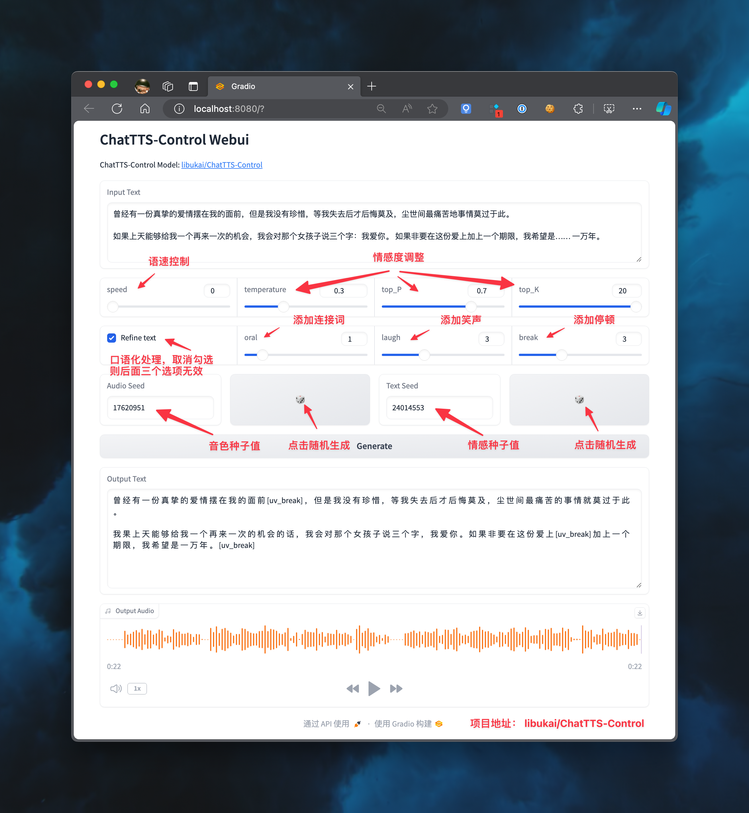

# 1、[stabilityai/stable-audio-open-1.0](https://huggingface.co/stabilityai/stable-audio-open-1.0)(Max:47s)
## Official example prompts  |  [Index](../README.md)
- Simulate a forest ambiance with birds chirping and wind rustling through the leaves.
- Create a serene soundscape of a quiet beach at sunset.
- clapping.
- Recreate a gentle rainfall with distant thunder.
- Imagine a jazz cafe environment with soft music and ambient chatter.
- Rock beat played in a treated studio, session drumming on an acoustic kit.
# 2、facebook--music series (Max:30s):
- [facebook/musicgen-stereo-small](https://huggingface.co/facebook/musicgen-stereo-small)
- [facebook/musicgen-stereo-medium](https://huggingface.co/facebook/musicgen-stereo-medium)
- [facebook/musicgen-stereo-large](https://huggingface.co/facebook/musicgen-stereo-large)
- [facebook/musicgen-stereo-melody](https://huggingface.co/facebook/musicgen-stereo-melody)
- [facebook/musicgen-stereo-melody-large](https://huggingface.co/facebook/musicgen-stereo-melodyhttps://huggingface.co/facebook/musicgen-stereo-melody-large)
- [nateraw/musicgen-songstarter-v0.2](https://huggingface.co/nateraw/musicgen-songstarter-v0.2)
## Example prompts:
- Chinese traditional music.
- An 80s driving pop song with heavy drums and synth pads in the background.
- A cheerful country song with acoustic guitars.
- 90s rock song with electric guitar and heavy drums.
- a light and cheerly EDM track, with syncopated drums, aery pads, and strong emotions.
- lofi slow bpm electro chill with organic samples.
- Dance/EDM track with vibrant synths and a driving beat. bpm: 128.
- Corporate theme with an upbeat tempo and motivational melodies. bpm: 120.
-  Rock anthem with powerful guitar riffs and energetic drums. bpm: 140.
- Chill Out track with soothing ambient sounds and relaxed tempo. bpm: 90.
- Hip Hop beat with hard-hitting bass and catchy rhythms. bpm: 95.
- Orchestral piece with dramatic strings and grand composition. bpm: 70.
- Funk groove with groovy basslines and rhythmic guitars. bpm: 110.
- Video Game music with retro synths and catchy chiptune melodies. bpm: 130.
- Folk song with acoustic guitar and harmonious vocals. bpm: 85.
- Ambient soundscape with ethereal pads and calming tones. bpm: 60.
- Jazz tune with smooth saxophone and swinging rhythms. bpm: 120.
- Kids music with cheerful melodies and playful instruments. bpm: 100.
- Pop hit with catchy hooks and upbeat rhythms. bpm: 115.
- Production music with versatile sounds for various media. bpm: 110.
- Electronic piece with experimental sounds and unique textures. bpm: 125.
- Reggae rhythm with laid-back vibes and offbeat guitar chords. bpm: 75.
- Dance track with infectious beats and lively energy. bpm: 130.
- R&B tune with smooth vocals and soulful grooves. bpm: 90.
- Latin song with rhythmic percussion and fiery melodies. bpm: 105.
- Country track with twangy guitars and heartfelt storytelling. bpm: 85.
- Indian music with traditional instruments and intricate rhythms. bpm: 95.
## musicgen-songstarter:
- musicgen-songstarter-v0.1 is a musicgen-melody fine-tuned on a dataset of melody loops from my Splice sample library. It's intended to be used to generate song ideas that are useful for music producers. It generates stereo audio in 32khz.
### Prompt Format:
- {tag_1}, {tag_1}, ..., {tag_n}, {key}, {bpm} bpm
#### For example:
- hip hop, soul, piano, chords, jazz, neo jazz, G# minor, 140 bpm
#### The training dataset had the following tags in it:
hip hop
trap
soul
rnb
synth
songstarters
melody
keys
chords
guitar
vocals
dancehall
melodic stack
piano
electric
layered
music
drill
lo-fi hip hop
cinematic
pop
resampled
afropop & afrobeats
strings
leads
dark
african
acoustic
brass & woodwinds
live sounds
reggaeton
boom bap
pads
electric piano
fx
downtempo
wet
electric guitar
lo-fi
caribbean
chops
chillout
riffs
percussion
electronic
bass
choir
arp
uk drill
female
plucks
future bass
processed
future soul
ensemble
mallets
hooks
uk
flute
phrases
drums
atmospheres
jazz
emo
gospel
male
reverse
latin american
trap edm
latin
bells
pitched
ambient
tonal
distorted
moombahton
vinyl
orchestral
dry
psychedelic
edm
funk
neo soul
classical
harmony
adlib
trumpet
high
horns
electronica
violin
808
synthwave
ngoni
house
drones
progressive house
g-funk
hats
trip hop
baile funk
filtered
doo wop
tambourine
kora
stabs
textures
claps
grooves
clean
analog
harp
ambience
smooth
acapella
blues
saxophone
organ
soft
tremolo
chillwave
reverb
electric bass
low
moog
wah
wobble
indie pop
modular
sub
indie dance
glide
k-pop
afrobeat
mid
balafon
bitcrushed
phaser
middle eastern
zither
shakers
delay
tech house
disco
experimental
celesta
cello
drum and bass
trance
rock
rhythm
whistle
sidechained
saw
breakbeat
techno
brazilian
music box
glitch
clarinet
## Example prompts for musicgen-songstarter:
- trap, synthesizer, songstarters, dark, G# minor, 140 bpm.
- acoustic, guitar, melody, trap, D minor, 90 bpm.
- music, mallets, bells, melody, dancehall, african, afropop & afrobeats.
- synth, dark, hip hop, melody, trap.
# 3、ChatTTS
- 如果尾字吞字不读，可以试试结尾加上 [lbreak]
- If the input text is all in English, it is recommended to check disable_normalize
- 'oral' means add filler words, 'laugh' means add laughter, and 'break' means add a pause. (0-10)
- Today a man knocked on my door and asked for a small donation toward the local swimming pool. I gave him a glass of water.
- 四川美食确实以辣闻名，但也有不辣的选择。比如甜水面、赖汤圆、蛋烘糕、叶儿粑等，这些小吃口味温和，甜而不腻，也很受欢迎。[laugh]本姑娘先做再说，哪怕做成屎一样，在慢慢改[laugh]，不要整天犹犹豫豫[uv_break]，一个粗糙的开始，就是最好的开始，什么也别管，先去做，然后你就会发现，用不了多久，你几十万就没了[laugh]。
## Instructions:

# 4、OpenVoiceV2
- The input speech audio of OpenVoice can be in Any Language. OpenVoice can clone the voice in that speech audio, and use the voice to speak in multiple languages. 
# 5、XTTS v2
### Requirement for Japanese:
- pip install fugashi[unidic]
- python -m unidic download
### XTTS is a Voice generation model that lets you clone voices into different languages by using just a quick 3-second audio clip.
### XTTS-v2 supports 17 languages: English (en), Spanish (es), French (fr), German (de), Italian (it), Portuguese (pt), Polish (pl), Turkish (tr), Russian (ru), Dutch (nl), Czech (cs), Arabic (ar), Chinese (zh-cn), Japanese (ja), Hungarian (hu), Korean (ko) Hindi (hi).
- en: Hello, World !, here is an example of light voice cloning. Try to upload your best audio samples quality.
- fr: Je suis un lycéen français de 17 ans, passioner par la Cyber-Sécuritée et les models d'IA.
- de: Als ich sechs war, sah ich einmal ein wunderbares Bild.
- es: Cuando tenía seis años, vi una vez una imagen magnífica.
- pt: Quando eu tinha seis anos eu vi, uma vez, uma imagem magnífica.
- pl: Kiedy miałem sześć lat, zobaczyłem pewnego razu wspaniały obrazek.
- it: Un tempo lontano, quando avevo sei anni, vidi un magnifico disegno.
- tr: Bir zamanlar, altı yaşındayken, muhteşem bir resim gördüm.
- ru: Когда мне было шесть лет, я увидел однажды удивительную картинку.
- nl: Toen ik een jaar of zes was, zag ik op een keer een prachtige plaat.
- cs: Když mi bylo šest let, viděl jsem jednou nádherný obrázek
- zh-cn: 当我还只有六岁的时候， 看到了一副精彩的插画。
# 6、uvr5
# 7、noise supression
# Workflow
