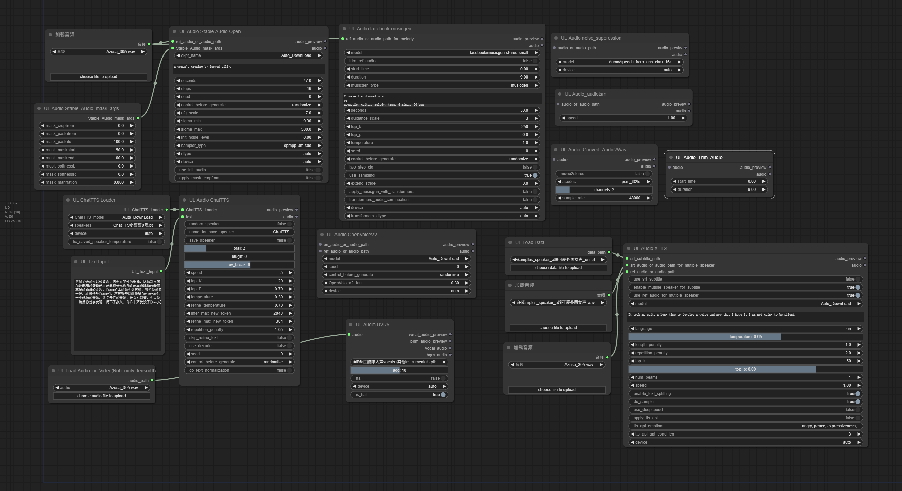

## Official example prompts
- Simulate a forest ambiance with birds chirping and wind rustling through the leaves.
- Create a serene soundscape of a quiet beach at sunset.
- clapping.
- Recreate a gentle rainfall with distant thunder.
- Imagine a jazz cafe environment with soft music and ambient chatter.
- Rock beat played in a treated studio, session drumming on an acoustic kit.

