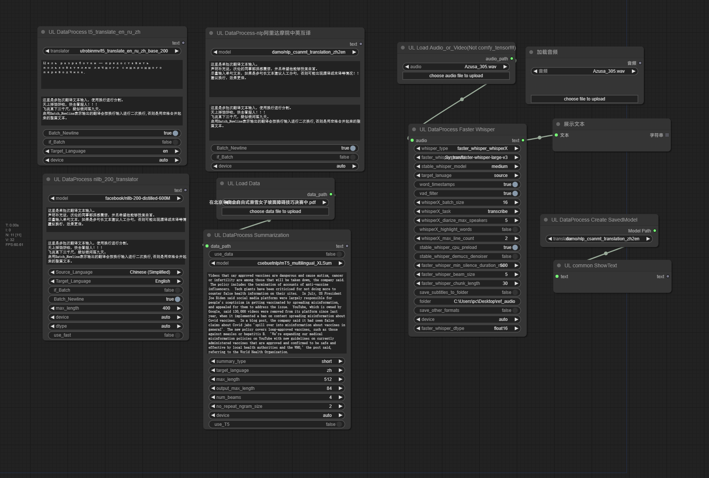

# My Personal custom-nodes | For Study Purpose Only | Not Recommeded  |  Will Not Accept Any Issue
# 个人专属插件  |  仅用于学习  |  不建议使用  |  不接收issue

## 1、[AnyText](./AnyText/README.md) 
- Original Github Repo: [tyxsspa/AnyText](https://github.com/tyxsspa/AnyText)
- Original Modelscope Repo: [damo/cv_anytext_text_generation_editing](https://modelscope.cn/models/iic/cv_anytext_text_generation_editing/summary)
- Generate or edit texts in picture--生成或者编辑图片中的文字。
- Use [ComfyUI-AnyText](https://github.com/zmwv823/ComfyUI-AnyText) instead--使用[ComfyUI-AnyText](https://github.com/zmwv823/ComfyUI-AnyText)替代。
- 

## 2、[MiaoBi](./MiaoBi/README.md)
- Original Github Repo: [ShineChen1024/MiaoBi](https://github.com/ShineChen1024/MiaoBi)
- Original Huggingface Repo: [ShineChen1024/MiaoBi](https://huggingface.co/ShineChen1024/MiaoBi)
- Generate picture with Chinese prompt--使用中文提示词生成图片。
- Use [ComfyUI_ExtraModels](https://github.com/city96/ComfyUI_ExtraModels) instead--使用[ComfyUI_ExtraModels](https://github.com/city96/ComfyUI_ExtraModels)替代。
- 

## 3、[Audio](./Audio/README.md)
### Warning: 
- **[mono2stereo--function]()** and **[audio_input--function]()** need ffmpeg in system env--**单声道转双声道** 和 **音频输入**需要ffmpeg在系统环境变量中。
### stable-audio-open-1.0:
- Original Github Repo: [stable-audio-open-1.0](https://github.com/Stability-AI/stable-audio-tools)
- Original Huggingface Repo: [stable-audio-open-1.0](https://huggingface.co/stabilityai/stable-audio-open-1.0)
- Generate sounds--生成各种声音。
### ChatTTS:
- Original Github Repo: [2Noise/ChatTTS](https://github.com/2noise/ChatTTS)
- Original Huggingface Repo: [2Noise/ChatTTS](https://huggingface.co/2Noise/ChatTTS)
- (TTS) Text to audio--文本转语音。
### facebook--musicgen-small: need ffmpeg--需要ffmpeg。
- Original Huggingface Repo: [facebook--musicgen-small](https://huggingface.co/facebook/musicgen-small)
- Generate music--生成音乐。
- Generate melody with ref_audio--使用参考音频生成旋律。
### OpenVoiceV2: need ffmpeg--需要ffmpeg。
- Original Github Repo: [myshell-ai/OpenVoice](https://github.com/myshell-ai/OpenVoice)
- Original Huggingface Repo: [myshell-ai/OpenVoiceV2](https://huggingface.co/myshell-ai/OpenVoiceV2)
- Voice clone--音色克隆。
### XTTS v2: need ffmpeg--需要ffmpeg。
- Original Github Repo: [coqui-ai/TTS](https://github.com/coqui-ai/TTS)
- Original Huggingface Repo: [coqui/XTTS-v2](https://huggingface.co/coqui/XTTS-v2)
- (TTS) Text to voice + Voice clone--文本转语音和音色克隆。
### uvr5: need ffmpeg--需要ffmpeg。
- Original Github Repo: [Anjok07/ultimatevocalremovergui](https://github.com/Anjok07/ultimatevocalremovergui)
- Original Huggingface Repo: [Delik/uvr5_weights](https://huggingface.co/Delik/uvr5_weights)
- Split vocal and bgm--分离人声和旋律。
### noise supression (16k/48k): need ffmpeg--需要ffmpeg。
- Original Modelscope Repo: [damo/speech_frcrn_ans_cirm_16k](https://www.modelscope.cn/models/iic/speech_frcrn_ans_cirm_16k)
- Original Modelscope Repo: [damo/speech_dfsmn_ans_psm_48k_causal](https://www.modelscope.cn/models/iic/speech_dfsmn_ans_psm_48k_causal)
- Acoustic noise suppression--人声降噪。
### Models:
- Manual model path, ignore it if auto download--手动放置模型位置，自动下载模型可无视。
```
PS D:\AI\ComfyUI_windows_portable\ComfyUI\models\audio_checkpoints>
├─ExtraModels
│  ├─models--facebook--encodec_32khz
│  ├─models--Systran--faster-whisper-faster-whisper-large-v2
│  ├─models--Systran--faster-whisper-large-v3
│  ├─models--Systran--faster-whisper-medium
│  ├─modelscope--damo--cv_dut-raft_video-stabilization_base
│  │  ├─ckpt
│  │  └─img
│  ├─modelscope--damo--speech_dfsmn_ans_psm_48k_causal
│  │  ├─examples
│  │  └─img
│  ├─modelscope--damo--speech_frcrn_ans_cirm_16k
│  ├─stable_whisper_model
│  └─uvr5
│      └─uvr5_weights
│          └─Onnx_dereverb_By_FoxJoy
├─models--coqui--XTTS-v1
├─models--coqui--XTTS-v2
│  └─2.0.3
├─models--Dzkaka--ChatTTS
│  ├─asset
│  └─config
├─models--facebook--musicgen-stereo-medium
├─models--facebook--musicgen-stereo-melody
├─models--facebook--musicgen-stereo-small
└─models--myshell-ai--OpenVoiceV2
    └─checkpoints
        └─converter
```
### UL_VAEDecodeAudio: Audio preview node for comfyui official audio_output--官方音频输出预览节点。
- 
### **Some code from github repo: [shadowcz007/comfyui-sound-lab](https://github.com/shadowcz007/comfyui-sound-lab)  |  [AIFSH/ComfyUI-GPT_SoVITS](https://github.com/AIFSH/ComfyUI-GPT_SoVITS)  |  [jianchang512/ChatTTS-ui](https://github.com/jianchang512/ChatTTS-ui)  |  [AIFSH/ComfyUI-UVR5](https://github.com/AIFSH/ComfyUI-UVR5)**
- 
## 4、[DataProcess](./DataProcess/README.md)
- Translators--翻译机。
- Docment summarization--文档总结。
- Make subtitle with faster-whisper--使用faster-whisper制作字幕。
- 
- Manual model path, ignore it if auto download--手动放置模型位置，自动下载模型可无视。
```
D:\AI\ComfyUI_windows_portable\ComfyUI\models\prompt_generator>
├─models--csebuetnlp--mT5_multilingual_XLSum
├─models--facebook--nllb-200-distilled-1.3B
├─models--facebook--nllb-200-distilled-600M
├─models--utrobinmv--t5_summary_en_ru_zh_base_2048
├─models--utrobinmv--t5_translate_en_ru_zh_base_200
├─models--utrobinmv--t5_translate_en_ru_zh_large_1024
├─models--utrobinmv--t5_translate_en_ru_zh_small_1024
├─nlp_csanmt_translation_zh2en
│  ├─CSANMT
│  │  └─variables
│  ├─resources
│  └─tf_ckpts
```
## 5、[Video]()
- Original Modelscope Repo: [damo/cv_dut-raft_video-stabilization_base](https://www.modelscope.cn/models/iic/cv_dut-raft_video-stabilization_base)
- Video Stabilization--视频防抖。
- 使用16G显存的显卡测试时，建议的最大输入为 30fps帧率下30s时长的1920x1080分辨率视频。
- 
## 6、[UL_common]()
- Text input--文本输入。
- 