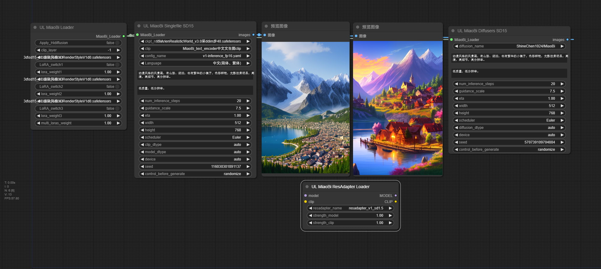
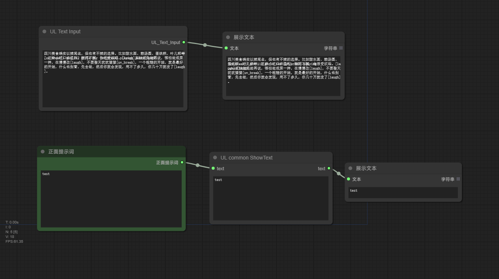

# My Personal custom-nodes | For Study Purpose Only | Not Recommeded  |  Will Not Accept Any Issue
# 个人专属插件  |  仅用于学习  |  不建议使用  |  不接收issue
# Warning:
- **Lots of bugs**---**大量bug**。
- Repo is large (total 170mb, 90mb without git_blob_file), because some special model (70mb) files in it. They are special for not easy to auto access them (diarization 3.1-need huggingface token) or nearly can't be used for other places (anytext-ocr model、OpenVoiceV2-WavMark) or modified (whisperx-vad-segmentation)---插件体积庞大(总共170mb，不含git编码文件则是90mb)，因为放了一些特殊模型(占用了70mb)在里面。这些模型要么很难自动获取(diarization 3.1-需要笑脸的个人用户口令)，要么几乎没法被其他插件复用(anytext-ocr model、OpenVoiceV2-WavMark)，要么修改过(whisperx-vad-segmentation)。
- **Tensorflow** need specified cuda_version to run on gpu, but on native windows [tensorflow 2.10+: look at the note](https://github.com/tensorflow/tensorflow/releases/tag/v2.11.1) will not work on cuda, we need linux or wsl2 to make gpu work. In this case, `damo/nlp_csanmt_translation_zh2en` translator will run slowly on cpu---**Tensorflow** 需要特定版本cuda才能跑到gpu上，但是在原生windows上 [tensorflow 2.10+：详情看note](https://github.com/tensorflow/tensorflow/releases/tag/v2.11.1) 无法调用gpu，必须使用linux或者wsl2才行。这种情况下`damo/nlp_csanmt_translation_zh2en`翻译只能跑在cpu上，速度很慢。
- **Deepspeed** for XTTS need specified **os、cuda version and torch version**, you have to pip install suitable deepspeed depend on your case---XTTS选项**Deepspeed** 需要**特定os、cuda版本和torch版本**，你需要手动pip安装适合你自己的deepspeed包
- Prebuilt deepspeed wheels---编译好的deepspeed whl文件 -----> [alltalk_tts/releases](https://github.com/erew123/alltalk_tts/releases)
# Models logic---模型逻辑:
- First check specified folder whether model exist, if ok then load model from folder. If not ok, auto download or load the auto downloaded cached model file---首先检查指定目录下是否存在模型文件，有的话加载该目录下的模型。没有的话，自动下载或者加载已经自动下载缓存好的模型文件。
# Abstract
- [AnyText](#anytext)
- [MiaoBi](#miaobi)
- [Audio](#audio)
- [DataProcess](#dataprocess)
- [Video](#video)
- [UL_common](#ul_common)
## [AnyText](./AnyText/README.md)
[Abstract](#abstract)
- Original Github Repo: [tyxsspa/AnyText](https://github.com/tyxsspa/AnyText)
- Original Modelscope Repo: [damo/cv_anytext_text_generation_editing](https://modelscope.cn/models/iic/cv_anytext_text_generation_editing/summary)
- Generate or edit texts in picture---生成或者编辑图片中的文字。
- Use [ComfyUI-AnyText](https://github.com/zmwv823/ComfyUI-AnyText) instead---使用[ComfyUI-AnyText](https://github.com/zmwv823/ComfyUI-AnyText)替代。
- 

## [MiaoBi](./MiaoBi/README.md)
[Abstract](#abstract)
- Original Github Repo: [ShineChen1024/MiaoBi](https://github.com/ShineChen1024/MiaoBi)
- Original Huggingface Repo: [ShineChen1024/MiaoBi](https://huggingface.co/ShineChen1024/MiaoBi)
- Generate picture with Chinese prompt---使用中文提示词生成图片。
- Use [ComfyUI_ExtraModels](https://github.com/city96/ComfyUI_ExtraModels) instead---使用[ComfyUI_ExtraModels](https://github.com/city96/ComfyUI_ExtraModels)替代。
- 

## [Audio](./Audio/README.md)
[Abstract](#abstract)
### stable-audio-open-1.0:
- Original Github Repo: [stable-audio-open-1.0](https://github.com/Stability-AI/stable-audio-tools)
- Original Huggingface Repo: [stable-audio-open-1.0](https://huggingface.co/stabilityai/stable-audio-open-1.0)
- Generate sounds---生成各种声音。
### ChatTTS:
- Original Github Repo: [2Noise/ChatTTS](https://github.com/2noise/ChatTTS)
- Original Huggingface Repo: [2Noise/ChatTTS](https://huggingface.co/2Noise/ChatTTS)
- (TTS) Text to audio---文本转语音。
### facebook--musicgen-small: 
- Original Huggingface Repo: [facebook--musicgen-small](https://huggingface.co/facebook/musicgen-small)
- Generate music---生成音乐。
- Generate melody with ref_audio---使用参考音频生成旋律。
- Transformers_audio_continuation not work---transformers_audio_continuation选项没能跑通。
##### 2 ways to implementation musicgen (not melody)---两种实现方法musicgen(非melody):
- Audiocraft: fp32 only---仅fp32.
- Transformers: much less control, such as without generation_length (seconds) control---可控参数很少，例如无法控制生成长度.
### OpenVoiceV2:
- Original Github Repo: [myshell-ai/OpenVoice](https://github.com/myshell-ai/OpenVoice)
- Original Huggingface Repo: [myshell-ai/OpenVoiceV2](https://huggingface.co/myshell-ai/OpenVoiceV2)
- Voice clone---音色克隆。
### XTTS v2:
- Original Github Repo: [coqui-ai/TTS](https://github.com/coqui-ai/TTS)
- Original Huggingface Repo: [coqui/XTTS-v2](https://huggingface.co/coqui/XTTS-v2)
- (TTS) Text to voice + Voice clone---文本转语音和音色克隆。
### uvr5:
- Original Github Repo: [Anjok07/ultimatevocalremovergui](https://github.com/Anjok07/ultimatevocalremovergui)
- Original Huggingface Repo: [Delik/uvr5_weights](https://huggingface.co/Delik/uvr5_weights)
- Split vocal and bgm---分离人声和旋律。
### noise supression (16k/48k):
- Original Modelscope Repo: [damo/speech_frcrn_ans_cirm_16k](https://www.modelscope.cn/models/iic/speech_frcrn_ans_cirm_16k)
- Original Modelscope Repo: [damo/speech_dfsmn_ans_psm_48k_causal](https://www.modelscope.cn/models/iic/speech_dfsmn_ans_psm_48k_causal)
- Acoustic noise suppression---人声降噪。
### audiotsm: change the speed of an audio signal without changing its pitch---音频变速不变调。
- Original Huggingface Repo: [Muges/audiotsm](https://github.com/Muges/audiotsm)
- [AudioTSM examples---官方示例](https://muges.github.io/audiotsm/)---[Docs(en) latest---最新英文文档](https://audiotsm.readthedocs.io/en/latest/)
### convert audio or video2wav
- use ffmpeg-python---[github--kkroening/ffmpeg-python](https://github.com/kkroening/ffmpeg-python)---[ffmpeg-python documentation---文档](https://kkroening.github.io/ffmpeg-python/)
### trim audio
- use pydub---[github--jiaaro/pydub](https://github.com/jiaaro/pydub)
### load audio or video
### Models:
- Manual place model_path, ignore it if auto download---手动放置模型位置，自动下载模型可无视。
```
PS D:\AI\ComfyUI_windows_portable\ComfyUI\models\audio_checkpoints>
├─ExtraModels
│  ├─models--facebook--encodec_32khz #musicgen stereo encodec立体声音频编码模型
│  ├─models--facebook--wav2vec2-base-960h #whisperx英文字幕对齐模型
│  ├─models--jonatasgrosman--wav2vec2-large-xlsr-53-chinese-zh-cn #whisperx中文字幕对齐模型
│  ├─models--Systran--faster-whisper-faster-whisper-large-v2 #faster—whisper字幕生成-大v2
│  ├─models--Systran--faster-whisper-large-v3 #faster—whisper字幕生成-大v3
│  ├─models--Systran--faster-whisper-medium #faster—whisper字幕生成-中
│  ├─modelscope--damo--cv_dut-raft_video-stabilization_base #video-stabilization视频防抖
│  │  ├─ckpt
│  │  └─img
│  ├─modelscope--damo--speech_dfsmn_ans_psm_48k_causal #noise_suppression单麦48k降噪
│  │  ├─examples
│  │  └─img
│  ├─modelscope--damo--speech_frcrn_ans_cirm_16k #noise_suppression单麦16k降噪
│  ├─stable_whisper_model #stable—whisper字幕生成单文件模型-包含大中小基础等模型
│  ├─uvr5 #人声、旋律分离
│  │  └─uvr5_weights
│  │      └─Onnx_dereverb_By_FoxJoy
│  └─wav2vec2_voxpopuli_base_10k_asr_es #whisperx西班牙语字幕对齐模型
├─models--coqui--XTTS-v1 #文本转语音加音色克隆
├─models--coqui--XTTS-v2 #文本转语音加音色克隆
├─models--Dzkaka--ChatTTS #文本转语音
│  ├─asset
│  └─config
├─models--facebook--musicgen-stereo-medium #立体声音乐生成-中
├─models--facebook--musicgen-stereo-melody #立体声旋律生成
├─models--facebook--musicgen-stereo-small #立体声音乐生成-小
└─models--myshell-ai--OpenVoiceV2 #音色克隆
    └─checkpoints
        └─converter
```
```
PS D:\AI\ComfyUI_windows_portable\ComfyUI\models\t5>
├─models--t5-base #t5-text-encoder文本编码模型(stable-audio-open、facebook/musicgen)
```
### Some code copy from github repo: 
**[shadowcz007/comfyui-sound-lab](https://github.com/shadowcz007/comfyui-sound-lab)  |  [jianchang512/ChatTTS-ui](https://github.com/jianchang512/ChatTTS-ui)  |  [AIFSH/ComfyUI-UVR5](https://github.com/AIFSH/ComfyUI-UVR5)  |  [AIFSH/ComfyUI-XTTS](https://github.com/AIFSH/ComfyUI-XTTS)**
- 
## [DataProcess](./DataProcess/README.md)
[Abstract](#abstract)
#### Translators--翻译机。
- **damo/nlp:** zh、en to each other **(tensorflow needed)**---中英互译 **(需要tensorflow)**.
- **t5:** zh、en、ru to each other---中英俄互译.
- **facebook/nllb:** lots of languages to each other---多语种互译.
#### Docment summarization--文档总结。
- just for test, not too much useful at now---仅供测试，目前效果一般，没什么用处。
#### Make subtitle with faster-whisper, 3 ways of implementation--使用faster-whisper制作字幕，包含3个实现。
- **stable-whisper:** it can generate word_level subtitle, only fp32---可以生成逐字级别字幕，仅支持fp32。
- **faster-whisper:** it can translate some languages to each other with large-v3---使用large-v3模型可以互译部分语言。
- **whisperX:** it can generate subtitle with speakerid---能生成带说话人id的字幕。
- **Extra:** faster-whisper and whisperX load the same models, stable-whisper load single_file models---faster-whisper和whisperX使用相同的模型，stable-whisper使用单文件模型.
- **Input and output**: if input is tensor (comfy_load_audio), output subtitle file name will be `whisper_subtitle_{time.time}.xxx`---如果使用tensor(comfy_load_audio)作输入，生成的字幕文件名为`whisper_subtitle_{time.time}.xxx`。
- 
### Models:
- Manual place model_path, ignore it if auto download---手动放置模型位置，自动下载模型可无视。
```
D:\AI\ComfyUI_windows_portable\ComfyUI\models\prompt_generator>
├─models--csebuetnlp--mT5_multilingual_XLSum #summerization文档总结模型
├─models--facebook--nllb-200-distilled-1.3B #nllb多语言互译1.3B模型
├─models--facebook--nllb-200-distilled-600M #nllb多语言互译600M模型
├─models--utrobinmv--t5_summary_en_ru_zh_base_2048 #summerization中英俄文档总结基础模型
├─models--utrobinmv--t5_translate_en_ru_zh_base_200 #t5中英俄互译基础模型
├─models--utrobinmv--t5_translate_en_ru_zh_large_1024 #t5中英俄互译大模型
├─models--utrobinmv--t5_translate_en_ru_zh_small_1024 #t5中英俄互译小模型
├─modelscope--damo--nlp_csanmt_translation_en2zh_base #damo/nlp阿里达摩院中英互译基础模型
│  ├─CSANMT
│  │  └─variables
│  ├─resources
│  └─tf_ckpts
├─modelscope--damo--nlp_csanmt_translation_zh2en #damo/nlp阿里达摩院中英互译完整模型
│  ├─CSANMT
│  │  └─variables
│  ├─resources
│  └─tf_ckpts
```
## [Video]()
[Abstract](#abstract)
### Video Stabilization--视频防抖。
- Original Modelscope Repo: [damo/cv_dut-raft_video-stabilization_base](https://www.modelscope.cn/models/iic/cv_dut-raft_video-stabilization_base)
- Max input 30fps-30s-1920x1080 video recommended when video card got 16GB vram---使用16G显存的显卡测试时，建议的最大输入为 30fps帧率下30s时长的1920x1080分辨率视频。
- 
## [UL_common]()
[Abstract](#abstract)
- Text input and ShowText---文本输入和显示文本。
- 