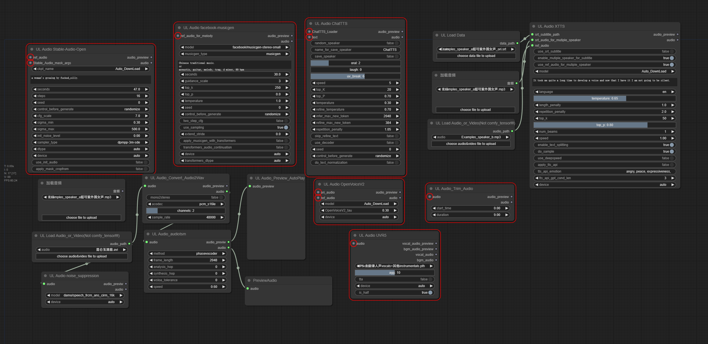

# My Personal custom-nodes | For Study Purpose Only | Not Recommeded  |  Will Not Accept Any Issue

## Warning: this custom_node takes 0.5s+ for importing when startup ComfyUI.

## 1、[AnyText](./AnyText/README.md) 
- Original Github Repo: [tyxsspa/AnyText](https://github.com/tyxsspa/AnyText)
- Original Modelscope Repo: [iic/cv_anytext_text_generation_editing](https://modelscope.cn/models/iic/cv_anytext_text_generation_editing/summary)
- Use [ComfyUI-AnyText](https://github.com/zmwv823/ComfyUI-AnyText) instead. It's incompatible with [ComfyUI-AnyText](https://github.com/zmwv823/ComfyUI-AnyText).
- 

## 2、[MiaoBi](./MiaoBi/README.md)
- Original Github Repo: [ShineChen1024/MiaoBi](https://github.com/ShineChen1024/MiaoBi)
- Original Huggingface Repo: [ShineChen1024/MiaoBi](https://huggingface.co/ShineChen1024/MiaoBi)
- Use [ComfyUI_ExtraModels](https://github.com/city96/ComfyUI_ExtraModels) instead.
- 

## 3、[Audio](./Audio/README.md)
### stable-audio-open-1.0
- Original Github Repo: [stable-audio-open-1.0](https://github.com/Stability-AI/stable-audio-tools)
- Original Huggingface Repo: [stable-audio-open-1.0](https://huggingface.co/stabilityai/stable-audio-open-1.0)
- Fork from Github Repo: [shadowcz007/comfyui-sound-lab](https://github.com/shadowcz007/comfyui-sound-lab)
- 